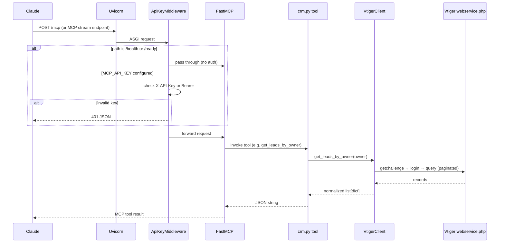

# Uniware Vtiger MCP — Technical Architecture

This document explains **where the application starts**, how modules connect, and the **end-to-end request flow** from Claude through this server to Vtiger CRM.

Phase 1 is intentionally **read-only**: three MCP tools query leads, deals, and overdue follow-ups. No write operations exist.

---

## 1. High-level architecture

```
┌─────────────┐     HTTP (MCP)      ┌──────────────────────┐     HTTP (webservice.php)     ┌─────────────┐
│   Claude    │ ──────────────────► │  vtiger_mcp (FastMCP)  │ ───────────────────────────► │  Vtiger CRM │
│  Connector  │   X-API-Key / Bearer │  Starlette + Uvicorn   │   session + vtiger query    │  (cloud)    │
└─────────────┘                     └──────────────────────┘                             └─────────────┘
```

| Layer | Module | Responsibility |
|-------|--------|----------------|
| **Entry** | `main.py` | Bootstraps FastMCP, registers routes and tools, exposes ASGI `app` |
| **Config** | `config.py` | Loads `.env` / environment into typed `Settings` |
| **Security** | `middleware.py` | Validates `X-API-Key` or `Authorization: Bearer` on protected paths |
| **MCP tools** | `tools/crm.py` | Defines the three tools Claude can call; maps errors to JSON strings |
| **CRM client** | `vtiger/client.py` | Vtiger login, paginated queries, field normalization |
| **Observability** | `logging_config.py` | Stdout logging level from `LOG_LEVEL` |

---

## 2. Where the code starts (entry points)

There are **four** ways the process can start. All converge on the same ASGI application object: `vtiger_mcp.main:app`.

| Entry | Command / trigger | What runs |
|-------|-------------------|-----------|
| **CLI script** | `vtiger-mcp` | `pyproject.toml` maps this to `vtiger_mcp.main:run` → Uvicorn |
| **Module direct** | `python -m vtiger_mcp.main` | `if __name__ == "__main__": run()` |
| **Uvicorn explicit** | `uvicorn vtiger_mcp.main:app --host 0.0.0.0 --port 8000` | Loads `app` directly (Docker, Render) |
| **Import / test** | `from vtiger_mcp.main import app` | Used by `scripts/mcp_check.py` for in-process ASGI tests |

### Docker / production start

```dockerfile
CMD ["uvicorn", "vtiger_mcp.main:app", "--host", "0.0.0.0", "--port", "8000"]
```

`PYTHONPATH` must include `src` so `vtiger_mcp` resolves (set in Dockerfile, Render, or shell).

---

## 3. Bootstrap sequence (import order)

When Python loads `vtiger_mcp.main`, execution happens **top to bottom** before any HTTP request arrives:

```
main.py imported
    │
    ├─► configure_logging()          # logging_config.py — reads LOG_LEVEL
    │
    ├─► get_settings()               # config.py — loads .env once (lru_cache)
    │
    ├─► FastMCP(...) created         # optional StaticTokenVerifier if MCP_AUTH_TOKEN set
    │
    ├─► register_tools(mcp)          # tools/crm.py — binds 3 @mcp.tool handlers
    │       └─► VtigerClient()       # one client instance shared by all tools
    │
    ├─► @mcp.custom_route /health, /ready registered
    │
    ├─► FASTMCP_STATELESS_HTTP env set if configured
    │
    └─► app = mcp.http_app(middleware=[ApiKeyMiddleware])
```

**Key point:** Tools and routes are registered at **import time**, not per request. `VtigerClient` is created once when tools register; each tool call may open a new HTTP session to Vtiger inside `query_all`.

---

## 4. HTTP request flow

### 4.1 Incoming request path



### 4.2 Public vs protected routes

`ApiKeyMiddleware` (`middleware.py`) runs on **every** request except:

| Path | Auth required | Purpose |
|------|---------------|---------|
| `/health` | No | Liveness probe |
| `/ready` | No | Config completeness check |
| `/mcp` (and other MCP paths) | Yes, if `MCP_API_KEY` is set | Tool invocations |

If `MCP_API_KEY` is **empty**, middleware allows all traffic through (useful for local dev only).

Accepted credentials (checked in order):

1. Header `X-API-Key: <MCP_API_KEY>`
2. Header `Authorization: Bearer <MCP_API_KEY>`

Separately, if `MCP_AUTH_TOKEN` is set, FastMCP's `StaticTokenVerifier` enables native Bearer auth at the MCP protocol layer.

---

## 5. MCP tool layer (`tools/crm.py`)

`register_tools(mcp)` attaches three async functions to the FastMCP server.

### Tool registry

| Tool name | Client method | Input | Output shape |
|-----------|---------------|-------|--------------|
| `get_leads_by_owner` | `VtigerClient.get_leads_by_owner` | `owner: str` | `{ owner, count, leads[] }` |
| `get_deals_by_owner` | `VtigerClient.get_deals_by_owner` | `owner: str` | `{ owner, count, deals[] }` |
| `get_overdue_followups` | `VtigerClient.get_overdue_followups` | `owner`, optional `as_of_date` | `{ owner, as_of_date, counts, leads[], deals[] }` |

### Design choices

- **Return type is `str`**, not a Python dict. FastMCP serializes tool results for the model; this project returns **pre-serialized JSON** via `json.dumps`.
- **Errors do not raise** to the MCP layer for `VtigerError`. They are caught and returned as JSON: `{"error": true, "tool": "...", "message": "..."}` so Claude always gets a structured response.
- **Invalid date format** on `get_overdue_followups` returns a JSON error without calling Vtiger.

### Tool → client flow (example)

```
get_leads_by_owner("19x5")
    → client.get_leads_by_owner("19x5")
        → build vtiger SQL query with configured field names
        → query_all(query)
        → normalize each raw record via _normalize_lead()
    → json.dumps({ owner, count, leads })
```

---

## 6. Vtiger client (`vtiger/client.py`)

`VtigerClient` is the only module that talks to Vtiger. It uses **Vtiger's legacy webservice API** at `{VTIGER_BASE_URL}/webservice.php`.

### 6.1 Authentication flow

Vtiger does not use the access key directly. Each client session follows this handshake:

```
1. GET  ?operation=getchallenge&username=<VTIGER_USERNAME>
         ← { token }

2. accessKey = MD5(token + VTIGER_ACCESS_KEY)

3. POST operation=login&username=...&accessKey=<hashed>
         ← { sessionName }

4. Subsequent queries use sessionName
```

`_session_name` is cached on the `VtigerClient` instance for the lifetime of that object. Because `query_all` opens a **new** `httpx.AsyncClient` context per call, the session is re-established when the client instance is new; in practice the single shared client in `register_tools` keeps the session across tool calls in the same process.

### 6.2 Query execution and pagination

`query_all(query)`:

1. Ensures login (`_get_session`)
2. Appends `LIMIT offset, page_size` to the SQL-like query
3. Calls `operation=query` with `sessionName`
4. Accumulates records until a batch has fewer than `page_size` rows (max 100 per Vtiger limits)
5. Returns `list[dict]` of raw Vtiger field names → values

Page size comes from `VTIGER_QUERY_PAGE_SIZE` (capped at 100).

### 6.3 Query building per tool

**Leads** (`get_leads_by_owner`):

```sql
SELECT id, assigned_user_id, company, leadstatus, ... 
FROM Leads 
WHERE assigned_user_id = '19x5';
```

Field and module names are **not hardcoded** in queries — they come from `Settings` (`VTIGER_FIELD_*`, `VTIGER_LEADS_MODULE`).

**Deals** (`get_deals_by_owner`):

- Same owner filter on `Potentials` (configurable module name)
- If `VTIGER_OPEN_DEAL_STAGES` is set, adds `sales_stage IN ('Prospecting', ...)`
- If stages list is empty, returns **all** deals for that owner regardless of stage

**Overdue follow-ups** (`get_overdue_followups`):

- Runs **up to two** queries (leads and/or deals) depending on whether follow-up date fields are configured
- Filter: `followup_date_field <= as_of_date` (default: server local `date.today()`)
- Skips lead query entirely if `VTIGER_FIELD_LEAD_FOLLOWUP_DATE` is unset; same for deals

### 6.4 Security in query construction

User-supplied values (`owner`, dates, stage names) pass through `_quote()` (SQL string escaping).

Module and field names from config pass through `_validate_field` / `_validate_module` — only `[A-Za-z0-9_]` allowed. This blocks injection via misconfigured or malicious env values.

### 6.5 Response normalization

Raw Vtiger records use **CRM-specific field API names** (e.g. `cf_potentials_nextfollowupdate`). Normalizers map them to stable keys for Claude:

| Normalized key (leads) | Config source |
|------------------------|---------------|
| `id` | always `id` |
| `owner` | `VTIGER_FIELD_LEAD_OWNER` |
| `organisation_name` | `VTIGER_FIELD_LEAD_ORG` |
| `status` | `VTIGER_FIELD_LEAD_STATUS` |
| `next_followup_date` | `VTIGER_FIELD_LEAD_FOLLOWUP_DATE` |
| `next_followup_description` | `VTIGER_FIELD_LEAD_FOLLOWUP_DESC` |

Deals follow the same pattern (`deal_name`, `stage`, `amount`, `last_contacted_date`, etc.).

---

## 7. Configuration (`config.py`)

`Settings` is a **Pydantic Settings** class:

- Reads from environment variables and optional `.env` file
- Cached via `@lru_cache` on `get_settings()` — one instance per process
- `vtiger_base_url` trailing slash stripped automatically

Helper methods used by the client:

| Method | Used for |
|--------|----------|
| `vtiger_webservice_url` | Full URL to `webservice.php` |
| `open_deal_stage_list` | Parses comma-separated `VTIGER_OPEN_DEAL_STAGES` |
| `lead_select_fields()` | Dynamic `SELECT` column list for leads |
| `deal_select_fields()` | Dynamic `SELECT` column list for deals |

`/ready` in `main.py` mirrors required config: Vtiger URL/username/key, `MCP_API_KEY`, and at least one follow-up date field.

---

## 8. Readiness vs liveness

| Endpoint | Logic | HTTP status |
|----------|-------|-------------|
| `/health` | Always returns `{"status": "healthy"}` | 200 |
| `/ready` | Builds `missing_configuration` list; `ready` or `degraded` | 200 or 503 |

Use `/health` for process-up checks (load balancer, Docker). Use `/ready` before routing Claude traffic in a new deployment.

---

## 9. End-to-end example: daily briefing

**Scenario:** Claude asks for overdue follow-ups for AM user `19x5`.

```
1. Claude connector → POST /mcp
   Headers: X-API-Key: <secret>

2. ApiKeyMiddleware validates key

3. FastMCP dispatches tool: get_overdue_followups(owner="19x5")

4. crm.py parses as_of_date (default today: 2026-06-11)

5. VtigerClient.get_overdue_followups:
   a. Lead query (if lead follow-up field configured):
      SELECT ... FROM Leads WHERE assigned_user_id = '19x5' AND cf_xxx <= '2026-06-11';
   b. Deal query (if deal follow-up field configured):
      SELECT ... FROM Potentials WHERE assigned_user_id = '19x5' AND cf_potentials_nextfollowupdate <= '2026-06-11';
   c. Each query paginated via LIMIT 0,100; LIMIT 100,100; ...

6. Records normalized to stable JSON keys

7. crm.py returns JSON string to FastMCP → Claude

8. Claude formats natural-language briefing for the Account Manager
```

---

## 10. Project file map

```
phase1_vtiger/
├── src/vtiger_mcp/
│   ├── main.py              ← START: app bootstrap, health routes, uvicorn entry
│   ├── config.py            ← Environment → Settings
│   ├── logging_config.py    ← Logging setup
│   ├── middleware.py        ← API key gate
│   ├── tools/
│   │   ├── __init__.py      ← Re-exports register_tools
│   │   └── crm.py           ← MCP tool definitions
│   └── vtiger/
│       ├── __init__.py
│       └── client.py        ← Vtiger webservice client
├── scripts/
│   ├── connection_check.py  ← External Vtiger + HTTP health probe
│   ├── mcp_check.py         ← In-process ASGI test of /health, /ready, /mcp
│   ├── describe_fields.py   ← Vtiger field discovery helper
│   └── test_tools.py        ← Direct tool/client exercise
├── Dockerfile               ← Container entry via uvicorn
├── render.yaml              ← Render.com deploy manifest
├── pyproject.toml           ← Package metadata + vtiger-mcp console script
├── requirements.txt         ← Pip dependencies
└── .env.example             ← Documented configuration template
```

---

## 11. Dependencies and frameworks

| Package | Role in this project |
|---------|---------------------|
| **fastmcp** | MCP server framework; exposes HTTP app, tool decorators, optional auth |
| **uvicorn** | ASGI server hosting `app` |
| **starlette** | Underlying HTTP (middleware, JSONResponse) |
| **httpx** | Async HTTP client for Vtiger webservice |
| **pydantic / pydantic-settings** | Typed configuration |
| **python-dotenv** | `.env` file loading (via pydantic-settings) |

---

## 12. Phase 1 boundaries (intentional limits)

- **Read-only** — no `create`, `update`, `revise`, or `delete` Vtiger operations
- **Three tools only** — scoped to AM briefing use cases
- **Owner ID required** — Claude must know the Vtiger user ID; no user lookup tool yet
- **Field names via env** — CRM custom fields (`cf_*`) must be configured before follow-up tools work fully
- **Session per process** — no distributed session store; horizontal scale = one Vtiger login per worker

---

## 13. Extending the codebase

Typical extension points for Phase 2+:

| Change | Where to edit |
|--------|---------------|
| Add a new MCP tool | `tools/crm.py` — new `@mcp.tool` + `VtigerClient` method |
| New Vtiger query logic | `vtiger/client.py` |
| New env / field mapping | `config.py` + `.env.example` |
| New public route | `main.py` — `@mcp.custom_route` |
| Stricter auth | `middleware.py` or FastMCP `StaticTokenVerifier` in `main.py` |

Keep tool handlers thin: validate inputs in the tool, put CRM logic in `VtigerClient`, keep configuration in `Settings`.
